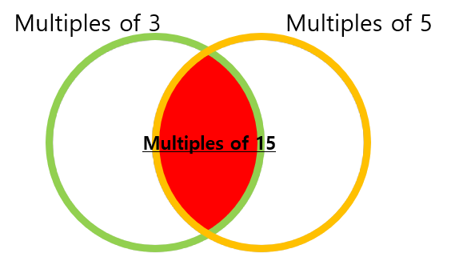

# Problem 0001 - Multiples of 3 and 5
## Problem
___If we list all the natural numbers below 10 that are multiples of 3 or 5, we get 3, 5, 6 and 9. The sum of these multiples is 23.___

___Find the sum of all the multiples of 3 or 5 below 1000.___

## Solution


If S(n) is the sum of all the multiples of n, the answer is...

$$
\therefore \quad answer\quad =\quad S(3)\quad +\quad S(5)\quad -\quad S(15)
$$

### 1. loop
```cpp
limit <- 999;
sum <- 0;

for num <- 3 to limit {
	if(num % 3 == 0 or num % 5 == 0 ) then sum += num;
}
	
```

### 2. arithmetic sequence (I soleved it this way!)
```cpp
// For sum of multiples of n, we use arithmetic sequence (등차수열 공식).
// m -> the first term to multiply
// l -> the last term = a + (n-1)d
// n -> n times
// sum of multiples = n(m + l) / 2

limit <- 999;

sum_of_multiples(m) {
	n <- limit/m;
    l <- n * m;
    
    return n*(m + l)/2; // = m*n*(n+1) / 2
}

 ...
 
	result <- sum_of_multiples(3) + sum_of_multiples(5) - sum_of_multiples(15);

 ...

```
